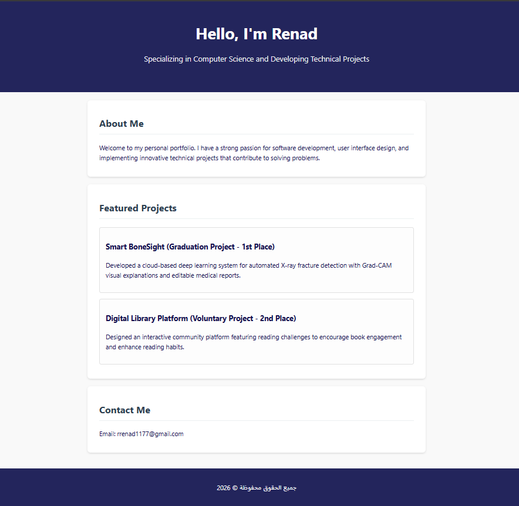

# Portfolio-website
A modern and responsive personal portfolio website built with **HTML** and **CSS** to showcase my academic and technical projects.

##  Featured Projects
* **Smart BoneSight (Graduation Project - 1st Place):** A cloud-based deep learning system for automated X-ray fracture detection featuring Grad-CAM visual explanations and editable medical reports.
* **Digital Library Platform (Voluntary Project - 2nd Place):** An interactive community platform designed with reading challenges to encourage book engagement and enhance reading habits.

##  Built With
* HTML5
* CSS3

##  How to Run the Project Locally
1. Clone this repository or download the files as a ZIP.
2. Ensure both `index.html` and `style.css` are in the same folder.
3. Open `index.html` in any web browser to view the portfolio.

## 📸 Preview

